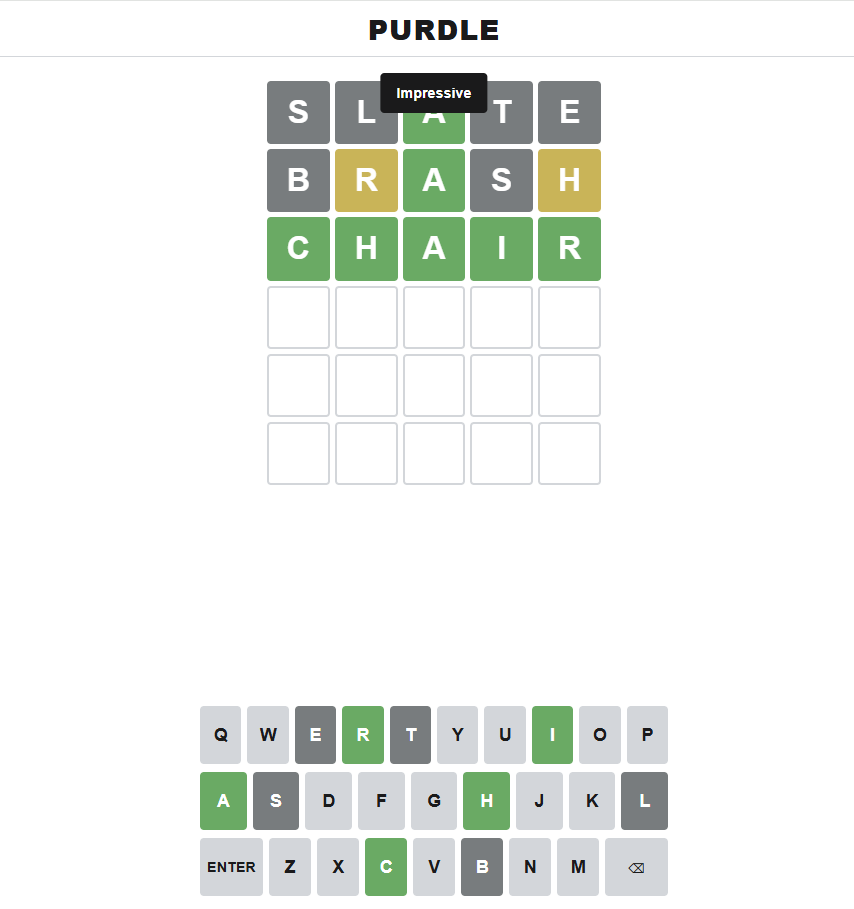

# Purdle

A daily five-letter word puzzle in the Wordle tradition — but every puzzle is generated by an automated pipeline of an LLM and classical ML, with **no human in the loop**.

> **Live:** https://pedromussi1.github.io/Purdle/



The game itself is a faithful Wordle clone: 6 guesses, green / yellow / grey feedback, daily puzzle, hard mode, color-blind palette, dark mode, local stats with shareable emoji grid, and a playable archive of past puzzles. The interesting part is everything *behind* the puzzle.

---

## Why this exists

Most Wordle clones rely on a hand-curated answer list and a human editor. Purdle replaces that editorial step with a reproducible automated pipeline:

```
                       ┌──────────────────────────────────────────┐
                       │  GitHub Actions cron — 00:05 UTC daily   │
                       └──────────────────┬───────────────────────┘
                                          │
                                ┌─────────▼─────────┐
                                │  Gemini 2.5       │
                                │  Flash-Lite       │  (proposes a 5-letter word
                                │                   │   + difficulty + theme +
                                └─────────┬─────────┘   etymology, JSON-strict)
                                          │
            ┌─────────────────────────────┼─────────────────────────────┐
            ▼                             ▼                             ▼
    ┌───────────────┐           ┌───────────────┐           ┌─────────────────┐
    │ wordfreq      │           │ better-       │           │ sentence-       │
    │ (Zipf ≥ 3.5)  │           │ profanity     │           │ transformers    │
    │ "common?"     │           │ filter        │           │ novelty < 0.75  │
    └───────┬───────┘           └───────┬───────┘           └────────┬────────┘
            └─────────────────┬─────────┴────────────────────────────┘
                              │  reject? feed reason back into next prompt
                              │  (up to 5 retries) — else fall back to a
                              │  deterministic date-hash pick from the
                              ▼  curated answer list
                    ┌───────────────────┐
                    │  YYYY-MM-DD.json  │
                    │  committed to     │
                    │  the repo         │
                    └─────────┬─────────┘
                              │
                              ▼
                    ┌───────────────────┐
                    │  GitHub Pages     │
                    │  static deploy    │
                    └─────────┬─────────┘
                              ▼
                       Browser fetches
                       today's puzzle
```

The pipeline never blocks: every external dependency (Gemini, the embeddings model, even the wordfreq + profanity libraries) is optional. If any one of them is missing or fails, the script falls back to a deterministic SHA-256-of-date pick from a curated answer list, so the site always has a puzzle to serve.

---

## The validation pipeline

A candidate from Gemini has to clear all of these before it ships:

| Check | Library | Reject when |
|---|---|---|
| Format | stdlib regex | Not exactly five lowercase letters |
| Recency | stdlib | Appeared in the last 30 puzzles |
| Curated dictionary | stdlib | Not in `scripts/answer_list.txt` |
| Profanity | `better-profanity` | Flagged as a slur or vulgarity |
| Frequency | `wordfreq` | Zipf score < 3.5 (too obscure) |
| Novelty | `sentence-transformers` | Cosine similarity > 0.75 vs any of the last 30 solutions |

When a candidate is rejected, the rejection reason is fed back into the prompt for the next attempt. After five failed attempts the script logs a warning and falls back to the deterministic pick.

---

## Tech stack

| Layer | Choice |
|---|---|
| Frontend | React 19 + Vite + TypeScript (strict) |
| State | Zustand (with `persist` middleware for stats + in-progress games) |
| Styling | CSS variables + tokens, no UI framework |
| Tests | Vitest (the green / yellow / grey evaluator gets the duplicate-letter edge cases right — see [`evaluate.test.ts`](src/games/wordle/lib/evaluate.test.ts)) |
| Pipeline | Python 3.12, Gemini 2.5 Flash-Lite, wordfreq, better-profanity, sentence-transformers |
| CI / Cron | GitHub Actions (free, unlimited minutes for public repos) |
| Hosting | GitHub Pages (zero servers, zero cost) |

Total runtime cost: **$0**.

---

## Run locally

### Frontend

```powershell
npm install
npm run dev          # http://localhost:5173/Purdle/
npm test             # Vitest — evaluator + hard-mode rules
npm run build        # tsc --build && vite build
```

### Pipeline

The generator runs without any deps using its deterministic-fallback path:

```powershell
python scripts/generate_puzzle.py --date 2026-05-06
```

For the full LLM-driven pipeline, install the requirements and provide a Gemini API key:

```powershell
python -m venv .venv
.\.venv\Scripts\Activate.ps1
pip install -r scripts/requirements.txt
$env:GEMINI_API_KEY = "<your-key>"
python scripts/generate_puzzle.py --date 2026-05-06 --force
```

Get a free key at https://aistudio.google.com/apikey — the free tier (≈ 1,000 requests/day on Flash-Lite) is two orders of magnitude more than this pipeline needs.

To seed many days at once (for the archive view):

```powershell
python scripts/bootstrap_puzzles.py --start 2026-05-06 --count 30
```

### One-time setup: word lists

Run once to refresh the answer list and the player-input dictionary:

```powershell
.\scripts\download_word_lists.ps1
```

---

## Repo layout

```
src/games/wordle/             # game-specific code (board, store, evaluator, pipeline hook)
src/shared/                   # game-agnostic shell (settings, modal, theme, date)
public/puzzles/wordle/en/     # daily puzzle JSON + manifest (committed by the workflow)
public/words/                 # valid-guess dictionary, fetched lazily by the client
scripts/                      # generator + bootstrap + word-list downloader
.github/workflows/            # deploy.yml (Pages) + daily-puzzle.yml (cron)
```

### Adding a new game

The shell is designed to host more games. To add e.g. a crossword:

1. Create `src/games/crossword/` with its own page, components, store, types.
2. Mount it under `/crossword` in `src/App.tsx`.
3. Build a parallel `scripts/generate_crossword.py` that writes to `public/puzzles/crossword/<lang>/<date>.json` (the `lang` field on the puzzle schema is forward-compatible — additional languages slot in as `crossword/es/`, etc.).
4. Add a sibling `daily-crossword.yml` workflow.

---

## Credits

- **Word lists:** combined valid-guess list from [tabatkins/wordle-list](https://github.com/tabatkins/wordle-list); curated answer list mirrored via [cfreshman](https://gist.github.com/cfreshman). Word lists are not copyrightable per *Feist v. Rural Telephone*.
- **Inspired by** the original Wordle by Josh Wardle, now operated by The New York Times.

License: [MIT](LICENSE).
